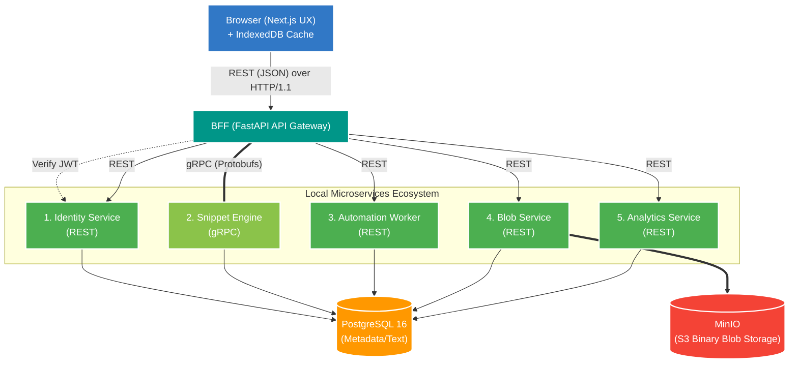
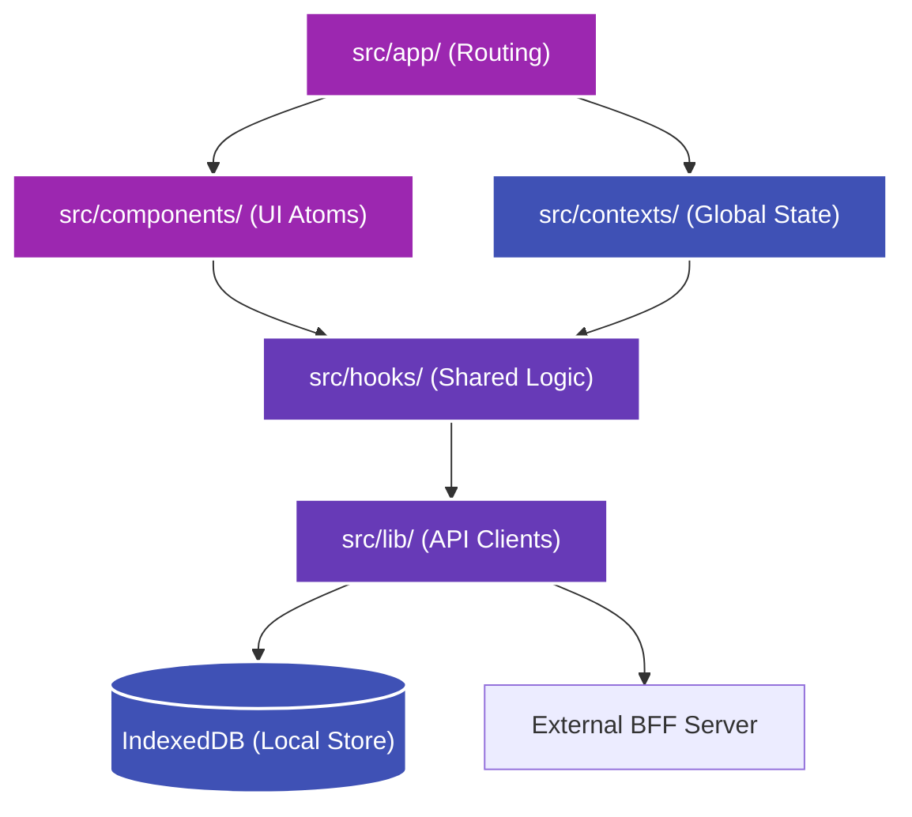
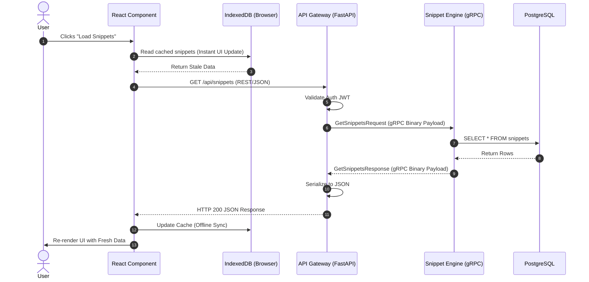

# Architecture: Universal Dev-Hub

This document contains the structural blueprints for the Universal Dev-Hub.

## 1. High-Level System Topology
This diagram illustrates the macro-architecture: how the browser, gateway, microservices, and databases connect.

## 2. Frontend Architecture (Next.js Application)
This diagram details how the Next.js application separates routing, logic, and UI components internally.

## 3. Data Flow Example: Fetching Snippets
This diagram tracks the lifecycle of a single request from the user's click to the database and back.

